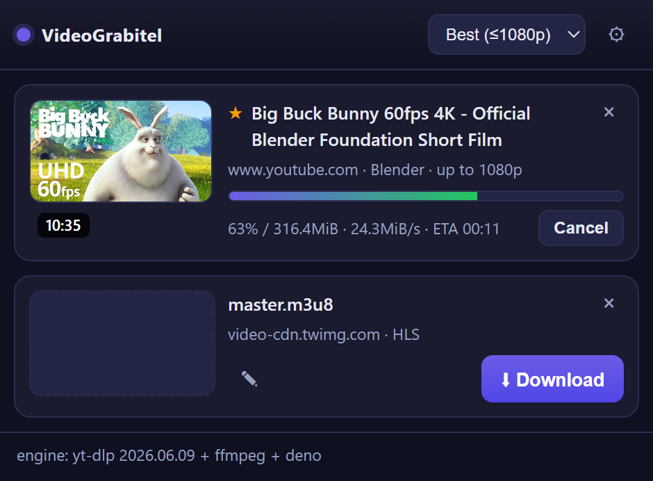

# VideoGrabitel

VideoGrabitel is an open-source video and audio downloader for Google Chrome,
Microsoft Edge, and other Chromium-based browsers. The browser extension detects
media resources and sends download requests to a local native-messaging host. The
host uses yt-dlp and ffmpeg to download and process files outside the browser.

All processing is performed on the local computer. VideoGrabitel does not upload
media, browsing data, or downloaded files to a separate service.



## Capabilities

- Supports websites handled by yt-dlp, including YouTube.
- Detects HLS, DASH, and direct media files.
- Displays titles, thumbnails, durations, available resolutions, and download
  progress in the extension popup.
- Supports video downloads up to 1080p by default and audio extraction to MP3.
- Allows the output filename to be edited before a download begins.
- Continues active downloads after the popup is closed.
- Opens completed files or displays them in the system file manager.
- Supports an optional HTTP or SOCKS proxy for the local download process.
- Filters stream segments, small media responses, script endpoints, and opaque
  generated resource names from the detected media list.

## System requirements

- Google Chrome, Microsoft Edge, or another compatible Chromium browser
- Node.js 18 or later available on `PATH`
- Windows, macOS, or Linux
- yt-dlp and ffmpeg
- Deno is recommended for reliable extraction from supported sites

## Installation

### Windows

Run the following commands in PowerShell or a terminal:

```powershell
git clone https://github.com/razreshitel/videograbitel.git
cd videograbitel
npm run setup
npm run install-host
```

`npm run setup` generates the extension icons and downloads yt-dlp, ffmpeg, and
Deno into the local `bin` directory. `npm run install-host` registers the local
native-messaging host for supported Chromium browsers.

### macOS and Linux

Install yt-dlp, ffmpeg, and Deno with the system package manager and ensure that
they are available on `PATH`. Then run:

```bash
git clone https://github.com/razreshitel/videograbitel.git
cd videograbitel
npm run setup
npm run install-host
```

On macOS and Linux, the setup script generates icons and reports any tools that
must be installed separately. The host installation script writes the native
messaging manifest to the supported browser directories.

### Load the extension

1. Open `chrome://extensions` in Chrome or `edge://extensions` in Edge.
2. Enable Developer mode.
3. Select Load unpacked.
4. Select the cloned `videograbitel` directory.
5. Reload the extension after the native host has been installed.
6. Open the VideoGrabitel popup and verify that the footer reports the yt-dlp
   and ffmpeg versions.

The extension ID is fixed by the key in `manifest.json`, which allows the native
host manifest to authorize the extension consistently.

## Usage

1. Open a page containing a video or audio resource.
2. Select the VideoGrabitel icon in the browser toolbar.
3. Review the main page video and any additional detected media.
4. Select the required quality from the toolbar.
5. Optionally edit the proposed filename.
6. Select Download.
7. After completion, select Open or Show in folder.

Downloaded files are written to the current user's Downloads directory.

## Proxy configuration

The native host runs outside the browser, so a browser-only VPN does not affect
its network traffic. Open the settings panel in the popup to configure an HTTP
or SOCKS proxy accepted by yt-dlp, for example:

```text
socks5://127.0.0.1:1080
http://proxy.example:8080
```

## Engine status and recovery

The popup displays a prominent error panel when the local engine is unavailable
or incomplete. The panel provides the appropriate recovery command and a button
to check the engine again.

If the native host is unavailable, run this command from the project directory:

```bash
npm run install-host
```

If yt-dlp or ffmpeg is missing on Windows, run:

```bash
npm run setup
```

On macOS or Linux, install the missing tool with the system package manager,
then select Check again in the popup.

The native host registration contains an absolute project path. If the project
directory is moved, run `npm run install-host` again and reload the extension.

To remove the native host registration:

```bash
npm run uninstall-host
```

## Architecture

| Component | Responsibility |
| --- | --- |
| `manifest.json` | Defines the Manifest V3 extension, permissions, and fixed extension key |
| `src/background/service-worker.js` | Records detected media by browser tab and manages the toolbar badge |
| `src/background/detector.js` | Classifies media responses and rejects known noise |
| `src/background/queue.js` | Manages download jobs and native host connections |
| `src/background/queue-core.js` | Provides testable queue selection helpers |
| `src/popup/` | Implements the popup interface, settings, progress, and engine status |
| `src/native-host/host.js` | Runs yt-dlp and ffmpeg and reports progress to the extension |
| `scripts/install-host.mjs` | Registers or removes the native-messaging host |
| `scripts/fetch-tools.mjs` | Downloads supported Windows tool binaries |

The extension communicates with the local host through the Chromium native
messaging protocol. Messages are JSON values prefixed by a four-byte
little-endian length. File data does not pass through the extension.

## Development

Run the automated tests:

```bash
npm test
```

Generate extension icons:

```bash
npm run icons
```

The generated `bin` and `icons` directories are not source dependencies and can
be recreated with the provided scripts.

## Limitations

- DRM-protected content, including Widevine and FairPlay streams, is not
  supported.
- The native host requires a one-time local installation.
- The Chrome Web Store can distribute the browser extension but cannot install
  its native-messaging host.
- Site compatibility depends in part on the installed yt-dlp version.
- On Windows, the installer normally builds a no-console launcher. If the C#
  compiler is unavailable, the batch launcher may briefly display a console
  window.

## License

VideoGrabitel is distributed under the MIT License. See [LICENSE](LICENSE).
